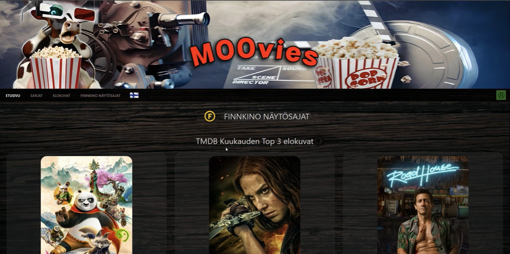
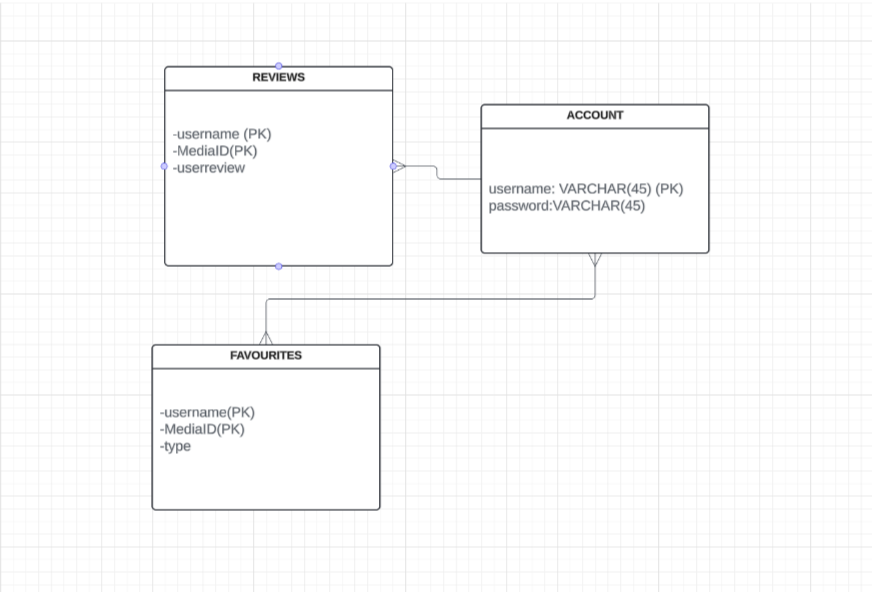
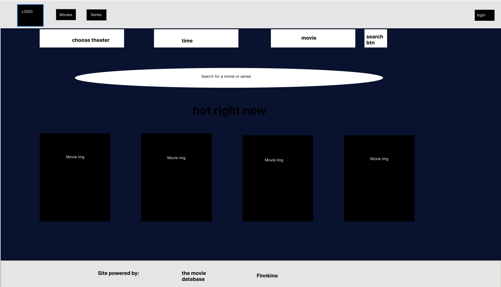
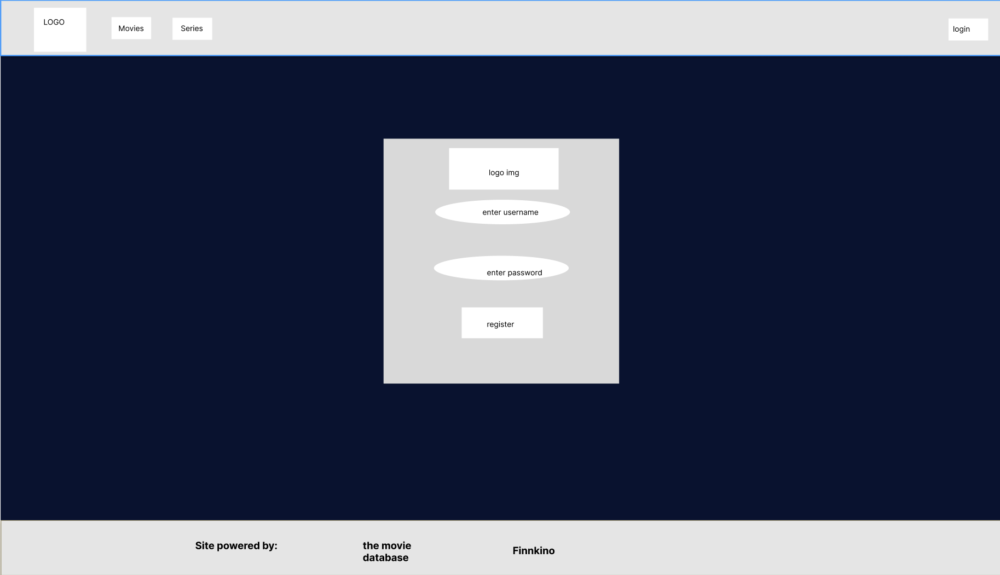

<h1>MOOvies-elokuvasovellus</h1>

 

<h2>Johdanto</h2>

MOOvies elokuvasovellus on Oulun ammattikorkeakoulun tieto- ja viestintätekniikan toisen vuoden opiskelijoiden tekemä web-ohjelmoinnin sovellusprojekti. 

 

<h2>Projektin esittely</h2>

MOOvies on elokuvasovellus, joka kokoaa yhteen leffaharrastajien tärkeimmät ominaisuudet. Sivustolta löytyy Finnkinossa esitettävien elokuvien esitysajat teatterikohtaisesti, hakutoiminto The Movie Database -sivuston kattavasta elokuva- ja sarjavalikoimasta sekä sivuston käyttäjien suosikit ja arvostelut. 

 

Sivustolla voi rekisteröidä käyttäjän, jonka myötä saa lisättyä elokuva- tai sarja-arvosteluja, lisättyä omia suosikkeja sekä jaettua suosikit muille. Käyttäjän voi halutessaan poistaa. Käyttäjän poiston myötä poistuu myös käyttäjän tekemät arvostelut sivustolta. Lisäominaisuutena sivustolla voi vaihtaa kieltä suomen ja englannin välillä. 

KUVA 1. Kuva kotisivusta. 
 

<h2>Sovelluksen suunnittelu </h2>

Sovelluksen suunnittelu aloitettiin hahmottelemalla tietokantarakennetta, josta laadittiin  luokkakaavio (kuva 2). Tietokannassa linkittyy yhteen käyttäjä-, arvostelu- ja suosikkitaulut. Yhdellä käyttäjällä voi olla useita elokuva- ja sarja-arvosteluja sekä useita suosikkielokuvia ja -sarjoja. 

KUVA 2. Projektin luokkakaavio    
Suunnitelmaa jatkettiin hahmottelemalla sivuston visuaalista puolta luomalla UI-kuvia. UI-kuvien avulla suunnitellaan sovelluksen graafista toteutusta, kuten kuvakkeita ja komponentteja. Sivuston väriteemaa suunniteltiin keulahahmosta, joka on sivuston nimen mukaisesti lehmä.   

KUVA 3. UI-kuva etusivusta   

KUVA 4. UI-kuva käyttäjän rekisteröintisivusta 
 

<h2>Sivuston toteutus  </h2>

UI-suunnitelman pohjalta aloitettiin työstämään frontend-osiota ja luokkakaavion pohjalta tietokantaa. Tietokantana käytettiin Postgrea, joka laitettiin jakoon Render-palveluun. Näin tietokanta on helposti kaikkien saatavilla, eikä tietokannan dump-tiedostoja tällöin joudu jakelemaan erikseen. Tietokanta on hyvin yksinkertainen. Tauluja on vain kolme: table_account, table_reviews ja table_favourites.  
 

<h3>Frontend </h3>

Frontend koodattiin käyttämällä Reactia, ja palvelinpuolen koodaus toteutettiin JavaScriptillä Node.js Express-kirjaston avulla. Frontend ja palvelin keskustelevat keskenään REST API:n kautta, mikä on myös toteutettu JavaScriptillä. REST API:ssa on erilaisia reittejä, kuten uuden käyttäjän lisääminen, käyttäjän kirjautuminen ja käyttäjän poisto. Lisäksi on reitit arvostelujen lisäämiselle ja poistamiselle. 

The Movie Databasen ja Finnkinon tietojen hakemiseen käytettiin HTTP GET -pyyntöjä tiettyihin osoitteisiin. Näillä pyynnöillä sovelluksen käyttäjä pystyy hakemaan haluamiaan elokuvia ja näytösaikoja. HTTP POST -pyyntöjä käytetään käyttäjän omien suosikkien lisäämiseen sovellukseen. 

<h3>Backend</h3>
Käyttäjän tietoturvan takaamiseksi käytössä on bcrypt- ja jsonwebtoken-kirjastot. Bcryptillä suolataan salasanat ennen niiden tallentamista tietokantaan, mikä parantaa niiden suojausta hyökkäyksiltä. 

Jsonwebtokenilla määritetään, mitä tietoja käyttäjä pääsee sovelluksessa näkemään. Tokenilla voi suojata esimerkiksi käyttäjän omia tietoja, kuten henkilökohtaisia asetuksia ja käyttäjätietoja.

Postman-työkalun avulla testattiin ja kehitettiin backendin päätepisteitä eli endpointeja. Nämä endpointit ovat URL-osoitteita, joihin frontendin puolelta tulee HTTP GET- ja POST -pyyntöjä. Aiemmin laaditun tietokannan luokkakaavion pohjalta määriteltiin erilaisia endpointeja sovellukseen. Näitä oli esimerkiksi käyttäjän rekisteröinti, käyttäjän sisäänkirjautuminen, käyttäjän poistaminen ja arvosteluiden tallentaminen tietokantaan. 
 
Backendiin rakennettiin myös sovellustestausta varmistaaksemme, että sovellus toimii luotettavasti eri käyttötilanteissa. Testeissä simuloitiin esimerkiksi käyttötilanteita, jossa käyttäjä syötti tyhjät tiedot rekisteröinnissä. Testaus auttoi havaitsemaan virheitä ja epäloogisuutta koodissa.  
 

Linkki Postman REST API dokumentaatioon

https://documenter.getpostman.com/view/30342408/2sA3BuXpVJ

<h2>Sivuston esittelyvideo</h2>
Linkki sivuston esittelyvideoon: 

https://www.youtube.com/watch?v=Sogr_6cR2UU&ab_channel=jaakkokoulu1

<h2>Työnjako </h2>

Jaakko Kaurala: Backend-reittien toteutus. Tietokantaan SQL queryjen toteutus. Finnkinon näytösaikojen toteutus. Elokuva-arvostelujen toteutus. Käyttäjän rekisteröityminen/ kirjautuminen/poistaminen. Testikoodien teko. 
 
Janniina Heikkinen: Tietokannan tekoa. Frontend-sivun muokkaamista. Alas-vetovalikon toteutus ja muokkaus.  

Pyry Liu: Frontend pohjan luonti, komponenttien ja sivujen alustukset. Elokuvalistan ja sarjalistan sisällön luonti. Suodatettu hakumahdollisuus elokuvien ja sarjojen listoista. Tarkemmat tiedot elokuvasta/sarjasta komponentin luonti ja sivujen reititys toisiinsa.  

Miia Alatervo: Tietokannan luonti. Frontend ulkoasun toteutus suunnitelmaa hyödyntäen. Lisäominaisuuden teko, joka oli sivuston kielen vaihdon mahdollisuus suomen ja englannin kielen välillä. Tähtiluokituksen teko arvosteluihin. Suosikkiominaisuuden teko frontend puolelle.  
